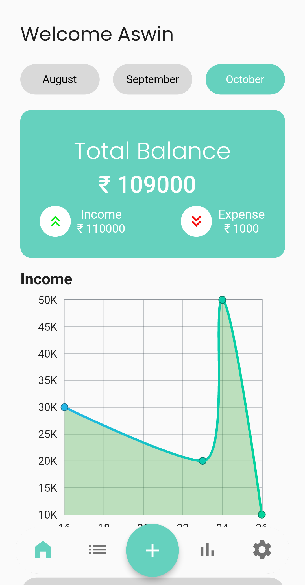
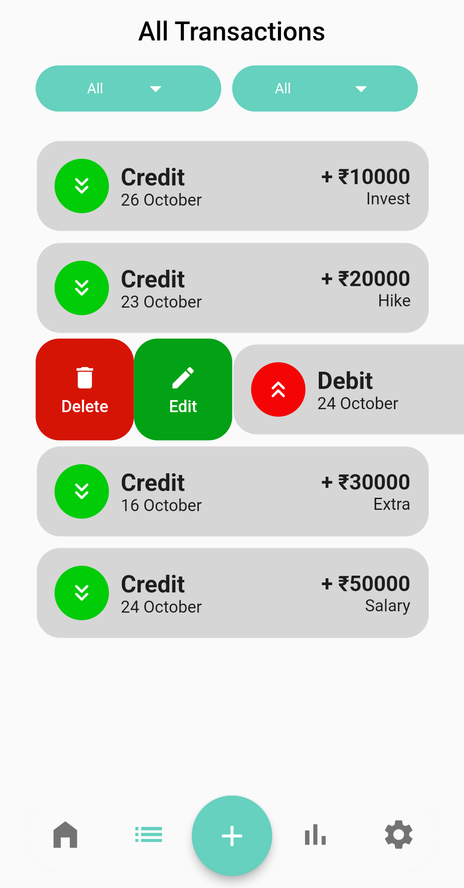
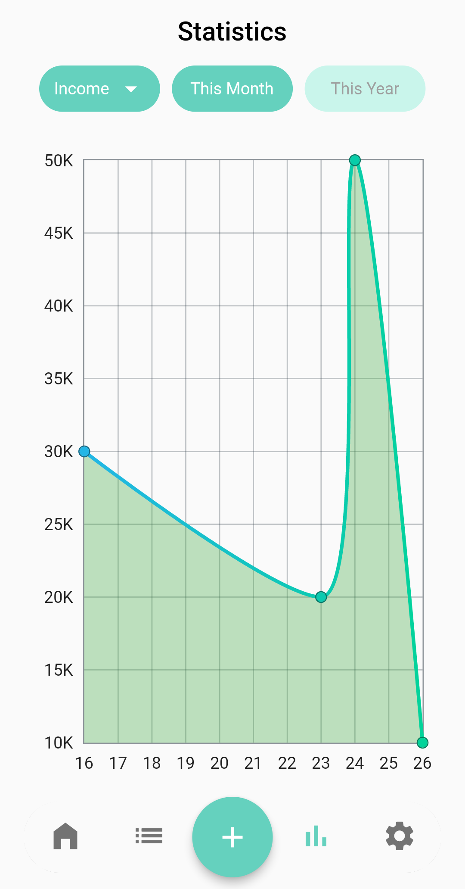

 # Mtracker

Mtracker is a money management application that shows
complete details about one's spending and earnings. Answer
the questions such as What, Where and How much money
spent.

## Table of contenst

- [Installation](#installation)
- [Usage](#usage)
- [Screeshots](#screenshots)
- [Packages and Credits](#packages-and-credits)
- [Google Play Store](#google-play-store)
- [License](#license)

## Installation

To install and run this project, you will need to have the following dependencies installed on
your machine:
 - Flutter SDK
 - Android Studio or Visual Studio Code

To install the project, follow these steps:

1. Clone the repository to your local machine
2. Open the project in Android Studio or Visual Studio Code
3. Connect an Android device or lauch an emulator
4. Run the command 'flutter pub get' using the terminal
5. Run the project by clicking the "run" button in the top menu or by using the terminal
   command 'flutter run'

## Usage 

User can do  the following:

- Add transaction in any category using the add trasaction screen 
- Reset the app data in setting, so the entire app data will be cleared
- Can see the total balance of the last three months on the home screen, so it's very easy for the user to check the last months transaction amount in a simple click
- Easily filter the transactions using the dropdowns in all transaction and statistics screen, in all transaction screen user can see the transactions according to transaction type, today wise, this month, and month wise of the current year
- Montior transaction flow using the graphs in the statistics screen were the user can see the type wise graphs of current and current year

## Screenshots 

Home Screen                    |   All transaction Screen             |  Statistics Screen 
:-------------------------:|:-------------------------:|:-------------------------:|
|||

## Packages and Credits

- [Animated Snackbar](https://github.com/JulyWitch/animated_snack_bar)
- [Auto size text](https://github.com/simc/auto_size_text)
- [Fl chart](https://github.com/imaNNeoFighT/fl_chart)
- [Flutter Slidable](https://github.com/letsar/flutter_slidable)
- [Flutter typeahead](https://github.com/AbdulRahmanAlHamali/flutter_typeahead)
- [Google fonts](https://github.com/material-foundation/google-fonts-flutter)
- [Hive flutter](https://github.com/hivedb/hive/tree/master/hive_flutter)
- [Shared preferences](https://github.com/flutter/plugins/tree/main/packages/shared_preferences/shared_preferences)
- [Time zone](https://github.com/srawlins/timezone)
- [Url launcher](https://github.com/flutter/plugins/tree/main/packages/url_launcher/url_launcher)
- [Flutter laucher icons](https://github.com/fluttercommunity/flutter_launcher_icons/)
- [Build runner](https://github.com/dart-lang/build/tree/master/build_runner)
- [Hive generator](https://github.com/hivedb/hive/tree/master/hive_generator)

## Google Play Store

The project is available for download on the Google Play Store [here](https://play.google.com/store/apps/details?id=com.aswinofficial3.mtracker).

## License

- MIT License
- Copyright 2022 © [ASWINSUBHASH](https://github.com/aswinsubhash)

